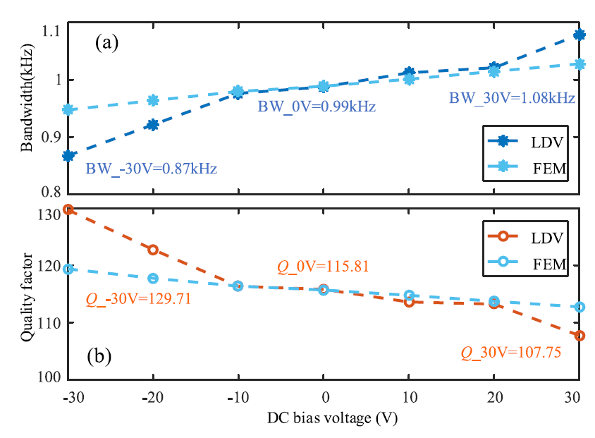

Research Interests
======
* The design and application of piezoelectric MEMS devices.
* The design and realization of sensor system for IOT.
* The fusion of robot and sensor.

Research Experience
======
## Ph.D. dissertation: Research on AlN-based Piezoelectric Micromachined Ultrasonic Transducer and the Range-finding System
 (Supervisor: Professor Chengliang Sun and Liang Lou) 
This research is focus on the development of ultrasonic range-finding sensor based on the AlN PMUTs and the fusion of robot and MEMS sensor. In this dissertation, an ultrasonic range-finding system based on AlN PMUTs is proposed. Then the above system is used on a collaborative robot. Finally, a human-robot interaction based on AlN PMUTs and the collaborative robot is realized. The main content of this dissertation is as follows: 
1. The influence of ringdown on AlN PMUTs and the strategy for suppressing ring-down: 
(1) The method of adjusting the characteristics of AlN PMUTs through the DC bias voltage is proposed, and the effects of DC bias voltage on characteristics for AlN PMUTs are investigated.As DC bias voltage is applied to the AlN piezoelectric layer, it would produce controllable stress leading to the variation of device response. As shown in Fig1 and Fig2, when the DC bias voltage is adjusted between -30 to 30V, experimental, the simulation results and experiment results show that characteristics such as the resonance frequency, the -3dB bandwidth(BW), and the Q vary almost linearly with respect to the bias voltage, which demonstrates the characteristics of AlN PMUTs can be adjusted through DC bias voltage. Compared to the non-biased condition, the -3dB BW is increased by 9.09% at 30V, whereas the Q is decreased by 6.96% at 30V. Increasing the BW and decreasing the Q would allow the ring-down time to be shorter. As shown in Fig3, compared to the non-biased condition, the ring-down time is decreased by 3.03% at 30V. As shown in Fig4, the biased PMUTs can cover an effective frequency range of 4.66 kHz through technology like frequency-hopping spread spectrum (FHSS), which is an increment of 370.71%, compared to an effective frequency range of only 0.99 kHz at non-biased conditions. This provides more potential applications, such as ultrasonic communication. 
The detail about this research can be found in [DIO:10.1109/TED.2021.3137766](http://dx.doi.org/10.1109/TED.2021.3137766){:target="_blank"}.  

    
     
   

        Fig1. Experiment dependence of resonant frequency on dc bias voltage.
    

    
 

 

 

    
     
   

        Fig2. Experiment dependence of (a) −3 dB BW and (b) Q on dc bias voltage.
    

    
 

 

 

    
     
   

        Fig3. Experiment dependence of ring-down time on dc bias voltage.
    

    
 

 

 

    
     
   

        Fig4. (a) Experimental frequency response of the PMUT array under dc bias voltage. (b) Effective frequency range under biased state and non-biased condition.
    

    
 

 

(2) A novel ring-down suppression system based on transfer function is proposed to suppress the ring-down time and decrease the blind area of PMUTs. 
2. The design of an ultrasonic range-finding system based on AlN PMUTs: 
(1) Designed an ultrasonic range-finding sensor based on AlN PMUTs, which is mounted on FPCB and can be applied on the surface of UR3 manipulator. 
(2) Built the scheme of the range-finding system and designed the digital signal processing program through LabVIEW. 
(3) Realized ultrasonic writing in a two-dimensional plane based the proposed ultrasonic range-finding system. 
3. The design of a human-robot interaction system based on AlN PMUTs and the UR3 manipulator: 
(1) Built the scheme of the human-robot interaction system based on the UR3 manipulator and the above ultrasonic range-finding sensor. 
(2) Gesture recognition is demonstrated through this system, then this information can control the motion of UR3 manipulator through ROS. 
(3) The built human-robot interaction system can realize gesture tracking and obstacle avoidance. 

## Ph.D. other research experience:
1. Designed and developed an ultrasonic proximity sensing skin for robot safety control based on PMUTs.
2. Designed a PMUTs based on piston mode.
3. Designed a broadband PMUTs with a resonant cavity.

## Shanghai Industrial μTechnology Research Institute research experience:
1. Designed and developed a miniaturized transit-time ultrasonic flowmeter based on ScAlN PMUTs for small-diameter applications.
2. Designed and developed a high-sensitivity bowel sound electronic monitor based on PMUTs.
3. Designed and developed a high sensitivity AlN-based MEMS hydrophone for pipeline leak monitoring.
4. Designed and developed an ultrasonic target detection system based on PMUTs.
5. Designed and developed a high-sensitivity MEMS accelerometer using the Sc0.8Al0.2N-based four beam structure.
6. Designed and developed an acoustic localization sensor based on MEMS microphone array for partial discharge.

## Master of Science research experience:
1. Designed a new self-adjusting support structure for the in-pipe robot to improve its motion ability in different pipe condition especially in vertical pipe.
2. Proposed a hierarchical fuzzy controller for the above robot, which can be utilized to implement autonomous movement in the pipe.

