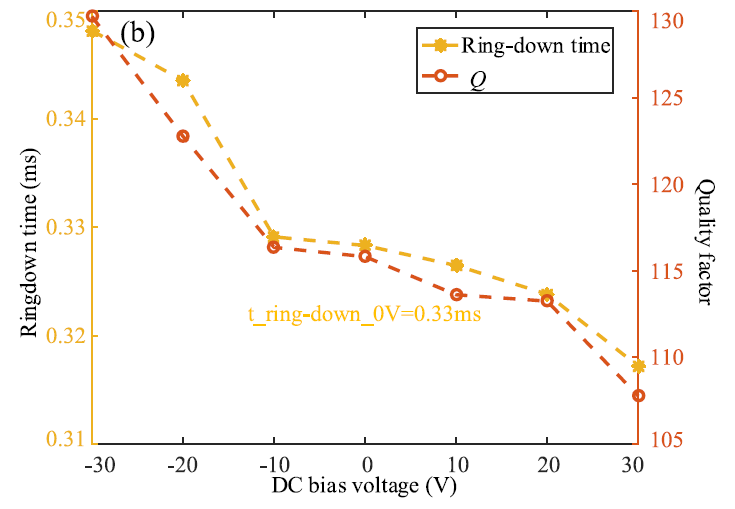
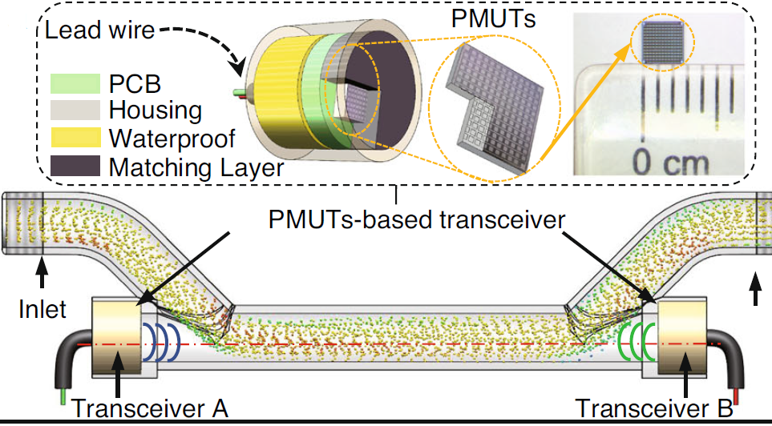

Research Interests
======
* The design and application of piezoelectric MEMS devices.
* The design and realization of sensor system for IOT.
* The fusion of robot and sensor.

Research Experience
======
## Ph.D. dissertation: Research on AlN-based Piezoelectric Micromachined Ultrasonic Transducer and the Range-finding System
 (Supervisor: Professor [Chengliang Sun](https://technology.whu.edu.cn/info/1015/1882.htm){:target="_blank"} and [Liang Lou](https://sme.shu.edu.cn/info/1028/1220.htm){:target="_blank"}) 
This research is focus on the development of ultrasonic range-finding sensor based on the AlN PMUTs and the fusion of robot and MEMS sensor. In this dissertation, an ultrasonic range-finding system based on AlN PMUTs is proposed. Then the above system is used on a collaborative robot. Finally, a human-robot interaction based on AlN PMUTs and the collaborative robot is realized. The main content of this dissertation is as follows: 
1.The influence of ringdown on AlN PMUTs and the strategy for suppressing ring-down: 
(1) The method of adjusting the characteristics of AlN PMUTs through the DC bias voltage is proposed, and the effects of DC bias voltage on characteristics for AlN PMUTs are investigated.As DC bias voltage is applied to the AlN piezoelectric layer, it would produce controllable stress leading to the variation of device response. As shown in Fig1 and Fig2, when the DC bias voltage is adjusted between -30 to 30V, experimental, the simulation results and experiment results show that characteristics such as the resonance frequency, the -3dB bandwidth(BW), and the Q vary almost linearly with respect to the bias voltage, which demonstrates the characteristics of AlN PMUTs can be adjusted through DC bias voltage. Compared to the non-biased condition, the -3dB BW is increased by 9.09% at 30V, whereas the Q is decreased by 6.96% at 30V. Increasing the BW and decreasing the Q would allow the ring-down time to be shorter. As shown in Fig3, compared to the non-biased condition, the ring-down time is decreased by 3.03% at 30V. As shown in Fig4, the biased PMUTs can cover an effective frequency range of 4.66 kHz through technology like frequency-hopping spread spectrum (FHSS), which is an increment of 370.71%, compared to an effective frequency range of only 0.99 kHz at non-biased conditions. This provides more potential applications, such as ultrasonic communication. 
The detail about this research can be found in [DIO:10.1109/TED.2021.3137766](http://dx.doi.org/10.1109/TED.2021.3137766){:target="_blank"}.  

    
     
   

        Fig1. Experiment dependence of resonant frequency on dc bias voltage.
    

    
 

 

 

    
     
   

        Fig2. Experiment dependence of (a) −3 dB BW and (b) Q on dc bias voltage.
    

    
 

 

 

    
     
   

        Fig3. Experiment dependence of ring-down time on dc bias voltage.
    

    
 

 

 

    
     
   

        Fig4. (a) Experimental frequency response of the PMUT array under dc bias voltage. (b) Effective frequency range under biased state and non-biased condition.
    

    
 

 

(2) A novel ring-down suppression system based on transfer function is proposed to suppress the ring-down time and decrease the blind area of PMUTs.As shown in Fig5, this suppression system includes a transfer function and a simple P (proportion) controller, which can reduce the ringdown time without degrading any performances of PMUTs. The transfer function serves as a virtual PMUT device and feeds its output into the P controller; then, the P controller generates a suppression signal to the actual PMUT device. The suppression system effectively reduces the blind area of the PMUT array by suppressing the ring-down of the PMUT array. The ring-down suppression effect of the suppression system on a PMUT array under different proportional parameters (1∼10) is experimented and the results is shown in Fig6. Through the suppression system, the ring-down time of a PMUT array is demonstrated to be reduced by up to 93%. In addition, the P controller has been experimentally optimized, reducing the blind area of the PMUT array by about 40%. 
The detail about this research can be found in [DIO:10.3390/s21196414](http://dx.doi.org/10.3390/s21196414){:target="_blank"}.  
 

    
     
   

        Fig5. The system architecture of the suppression system based on the transfer function of PMUTs.
    

    
 

 

 

    
     
   

        Fig6. The experimental result of the 115-kHz PMUT array under different k: (a) the mixed input signal, (b) the measurement result of LDV, (c) the measurement result of microphone, and (d) the measurement result of microphone under k = 2.
    

    
 

 

2.The design of an ultrasonic range-finding system based on AlN PMUTs: 
Firstly, an ultrasonic range-finding sensor is designed, which consists of three AlN PMUTs arrays, as shown in Fig7. The PMUT array have 9 (3×3) elements with the resonant frequency of 115kHz, the -3dB bandwidth of 0.99kHz and the Q factory of 115.81. In addition, this sensor is based on the FPCB and can be applied on curving surface such as the surface of UR3 manipulator. Then the pulse-echo method is used to realize the distance measurement in the range-finding system, and the digital signal processing program has also been designed through LabVIEW. The whole digital signal processing program includes the filtering program, the signal demodulation program, the Time of Flight (TOF) calculation program, and the coordinate of transmitter calculation program. The filtering program combines two methods of the wavelet filter and the bandpass filter. The Hilbert transform is used to obtained the envelope of the signal in the signal demodulation program. The linear fitting of leading edge of the signal envelope is used to calculate the TOF in the TOF calculation program, which is a simplified model fitting method. This method has the advantages of high accuracy and good real-time performance. The coordinate of transmitter calculation program solves the coordinates by analyzing the triangular relationship between the transmitter and the two receivers. The location performance of the proposed system is also characterized. The results show that the location performance and static performance of the proposed system is pretty good. Due to the high positioning accuracy of the proposed system, it can realize ultrasonic writing in a two-dimensional plane, as shown in Fig8. 
 

    
     
   

        Fig7. The designed ultrasonic range-finding sensor based on AlN PMUTs.
    

    
 

 

  

    
     
   

        Fig8. The demo of ultrasonic writing.
    

    
 

 

3.The design of a human-robot interaction system based on AlN PMUTs and the UR3 manipulator: 
The AlN PMUTs based ultrasonic range-finding system is combined with the UR3 manipulator to realize the human-robot interaction prototype system. According to the requirements of the human-robot interaction prototype system, the software and hardware scheme of the human-robot interaction system are built. An algorithm is proposed to gesture recognition which uses the distance and the angle between the current position of transmitter and the previous position of transmitter to recognize actions. This algorithm is programmed through LabVIEW and the effect of the algorithm is experimental demonstrated. The experiment results show that the effect of gesture recognition is very good within the range of 10cm×10cm which is 20cm away from the receiver, and the recognition rate can reach 100% within this range. Finally, the ultrasonic range-finding system based on PMUTs is combined with the UR3 manipulator based on ROS to realize the human-robot interaction between humans and collaborative robots. The experimental results show that the built human-robot interaction system can realize gesture tracking and obstacle avoidance, as shown in Fig9 and Fig10. 
  

    
     
   

        Fig9. The demo of gesture tracking based the proposed human-robot interaction system.
    

    
 

 

   

    
     
   

        Fig10. The demo of obstacle avoidance based the proposed human-robot interaction system.
    

    
 

 

## Ph.D. other research experience:
1.Designed and developed an ultrasonic proximity sensing skin for robot safety control based on PMUTs. 
Abstract: The safety issue of robot becomes a key challenge in modern manufacturing industry, especially in the scenario of frequent human-robot collaboration. This paper presents a flexible ultrasonic proximity sensing skinwhich can be integrated on the surface of robot arm to ensure the safe human-robot collaboration. The sensing skin is composed of three pieces of aluminum nitride based piezoelectric micromachined ultrasonic transducers (PMUTs) arrays at the resonance frequency of 115 kHz and chip size of 4 mm x 4 mm x 0.5 mm. The three pieces of PMUTs arrays are evenly integrated on the flexible printed circuit board (FPCB) with a device size of 8.8mm x 60 mm x 1.7 mm. The proximity sensing skin can detect obstacles within 300 mm and 60 degrees in front, and shows a large sensing coverage in comparison with capacitive/infrared devices. Besides, it is capable of sensing transparent materials like glass. Finally, since the small size and good scalability of micro-electro-mechanical system (MEMS), the PMUTs are easy to install onto robots and to integrate with other ultrasonic transducers in the future. This PMUTs based sensing skin will greatly enhance the sensing capability of robots and human safety during collaborative work. 
The detail about this research can be found in [DIO:10.1109/JSEN.2021.3068487](http://dx.doi.org/10.1109/JSEN.2021.3068487){:target="_blank"}.  
  

    
     
   

        Fig11. The structure of the proposed ultrasonic proximity sensing skin.
    

    
 

 

 
2.Designed a PMUTs based on piston mode. 
Abstract: This article presents a piezoelectric micromachined ultrasonic transducer (pMUT) modified with a piston diaphragm term as piston diaphragm pMUT (PD-pMUT). The transmission sound pressure level (SPL) and the frequency bandwidth of the modified transducer can be remarkably improved by adding a piston diaphragm on the central circular diaphragm. In this work, a lumped model, an acoustic resonance model, and an equivalent circuit model are established to study the multiresonance mechanism. The second resonance peak is contributed by the interference acoustic wave generated between the circular and piston diaphragms. This work demonstrated a simulated far-field average SPL up to 132.2 dB in the single modified piston diaphragm structure and a 28.1%–6-dB frequency bandwidth by theoretical analysis and parameter optimization. The bandwidth is 3.31 times of the traditional pMUT with aluminum nitride (AlN) in air. In addition, the PD-pMUT has a −6-dB frequency bandwidth of up to 66%, which is 1.4 times of traditional pMUT in the liquid-coupled operation. The proposed PD-pMUT provides a new approach for the application of high transmission power and broad bandwidth transducers. 
The detail about this research can be found in [DIO:10.1109/TUFFC.2021.3090043](http://dx.doi.org/10.1109/TUFFC.2021.3090043){:target="_blank"}.  
  

    
     
   

        Fig12. The structure of the PMUTs based on piston mode.
    

    
 

 

 
3.Designed a broadband PMUTs with a resonant cavity. 
Abstract: This article presents a broadband piezoelectric micromachined ultrasonic transducer (PMUT) surrounded by a resonant cavity called C-PMUT. The C-PMUT shows two resonancepeaks derived fromthe resonances of the active PMUT cell and the passive resonant cavity. Both of the two resonances vibrate at the first-order resonant mode. An equivalent circuit model is established considering the vibration of the resonant cavity and the crosstalk between the PMUT cell and the resonant cavity. Finite element analysis (FEA) has been used to verify the theoretical model. Bandwidth optimization has been operated and the −6 dB bandwidth is extended to more than 100% in liquid. Furthermore, the theoretical model of the C-PMUT array is established based on the C-PMUT cell. The FEA models of the C-PMUT arrays are proposed, and the −6 dB bandwidth of a 4 × 4 C-PMUT array is increased to 2× compared to the traditional array. Therefore, the C-PMUT provides a novel broadband strategy for future real-time ultrasound imaging. 
The detail about this research can be found in [DIO:10.1109/TUFFC.2021.3119669](http://dx.doi.org/10.1109/TUFFC.2021.3119669){:target="_blank"}.  
  

    
     
   

        Fig13. The structure of the broadband PMUTs with a resonant cavity.
    

    
 

 

## Shanghai Industrial μTechnology Research Institute research experience:
1.Designed and developed a miniaturized transit-time ultrasonic flowmeter based on ScAlN PMUTs for small-diameter applications. 
Abstract: Transit-time ultrasonic flowmeters (TTUFs) are among the most widely used devices for flow measurements. However, traditional TTUFs are usually based on a bulk piezoelectric transducer, which limits their application in small-diameter channels. In this paper, we developed a miniaturized TTUF based on scandium-doped aluminum nitride (ScAlN) piezoelectric micromachined ultrasonic transducers (PMUTs). The proposed TTUF contains two PMUT-based transceivers and a π-type channel. The PMUTs contain 13 × 13 square cells with dimensions of 2.8 × 2.8mm2. To compensate for the acoustic impedance mismatch with liquid, a layer of polyurethane is added to the surface of the PMUTs as a matching layer. The PMUT-based transceivers show good transmitting sensitivity (with 0.94 MPa/V surface pressure) and receiving sensitivity (1.79 mV/kPa) at a frequency of 1 MHz in water. Moreover, the dimensions of the π-type channel are optimized to achieve a measurement sensitivity of 82 ns/(m/s) and a signal-to-noise ratio (SNR) better than 15 dB. Finally, we integrate the fabricated PMUTs into the TDC-GP30 platform. The experimental results show that the developed TTUF provides a wide range of flow measurements from 2 to 300 L/h in a channel of 4 mm diameter, which is smaller than most reported channels. The accuracy and repeatability of the TTUF are within 0.2% and 1%, respectively. The proposed TTUF shows great application potential in industrial applications such as medical and chemical applications. 
The detail about this research can be found in [DIO:10.1038/s41378-023-00518-y](http://dx.doi.org/10.1038/s41378-023-00518-y){:target="_blank"} and [DIO:10.1109/MEMS49605.2023.10052185](http://dx.doi.org/10.1109/MEMS49605.2023.10052185){:target="_blank"}.  
  

    
     
   

        Fig14. The schematic of the developed ultrasonic flowmeter.
    

    
 

 

2.Designed and developed a high-sensitivity bowel sound electronic monitor based on PMUTs. 
Abstract: Bowel sounds contain some important human physiological parameters which can reflect information about intestinal function. In this work, in order to realize real-time monitoring of bowel sounds, a portable and wearable bowel sound electronic monitor based on piezoelectric micromachined ultrasonic transducers (PMUTs) is proposed. This prototype consists of a sensing module to collect bowel sounds and a GUI (graphical user interface) based on LabVIEW to display real-time bowel sound signals. The sensing module is composed of four PMUTs connected in parallel and a signal conditioning circuit. The sensitivity, noise resolution, and non-linearity of the bowel sound monitor are measured in this work. The result indicates that the designed prototype has high sensitivity (-142.69 dB), high noise resolution (50 dB at 100 Hz), and small non-linearity. To demonstrate the characteristic of the designed electronic monitor, continuous bowel sound monitoring is performed using the electronic monitor and a stethoscope on a healthy human before and after a meal. Through comparing the experimental results and analyzing the signals in the time domain and frequency domain, this bowel sound monitor is demonstrated to record bowel sounds from the human intestine. This work displays the potential of the sensor for the daily monitoring of bowel sounds. 
The detail about this research can be found in [DIO:10.3390/mi13122221](http://dx.doi.org/10.3390/mi13122221){:target="_blank"}.  
  

    
     
   

        Fig15. The designed the bowel sound electronic monitor
    

    
 

 

   

    
     
   

        Fig16. The experiment setup of the bowel sound electronic monitor
    

    
 

 

3.Designed and developed a high sensitivity AlN-based MEMS hydrophone for pipeline leak monitoring. 
Abstract: In this work, a miniaturized, low-cost, low-power and high-sensitivity AlN-based microelectro-mechanical system (MEMS) hydrophone is proposed for monitoring water pipeline leaks. The proposed MEMS Hydrophone consists of a piezoelectric micromachined ultrasonic transducer (PMUT) array, an acoustic matching layer and a pre-amplifier amplifier circuit. The array has 4 (2x2) PMUT elements with a first-order resonant frequency of 41.58 kHz. Due to impedance matching of the acoustic matching layer and the 40 dB gain of the pre-amplifier amplifier circuit, the packaged MEMS Hydrophone has a high sound pressure sensitivity of -170±2 dB (re: 1 V/uPa). The performance with respect to detecting pipeline leaks and locating leak points is demonstrated on a 31 m stainless leaking pipeline platform. The standard deviation (STD) of the hydroacoustic signal and Monitoring Index Efficiency (MIE) are extracted as features of the pipeline leak. A random forest model is trained for accurately classifying the leak and no-leak cases using the above features, and the accuracy of the model is about 97.69%. The cross-correlation method is used to locate the leak point, and the localization relative error is about 10.84% for a small leak of 12 L/min. 
The detail about this research can be found in [DIO:10.3390/mi14030654](http://dx.doi.org/10.3390/mi14030654){:target="_blank"}.  
   

    
     
   

        Fig17. The designed MEMS Hydrophone
    

    
 

 

4.Designed and developed an ultrasonic target detection system based on PMUTs. 
Abstract: In this paper, an ultrasonic target detection system based on Piezoelectric Micromachined Ultrasonic Transducers (PMUTs) is proposed, which consists of the PMUTs based ultrasonic sensor and the sensor system. Two pieces of 3 x 3 PMUTs arrays with the resonant frequency of 115 kHz are used as transmitter and receiver of the PMUTs-based ultrasonic sensor. Then, the sensor system can calculate the target’s position through the signal received by the above receiver. The static and dynamic performance of the proposed prototype system are characterized on black, white, and transparent targets. The experiment results demonstrated that the proposed system can detect targets of different colors, transparencies, and motion states. In the static experiments, the static location errors of the proposed system in the range of 200 mm to 320 mm are 0.51 mm, 0.50 mm and 0.53 mm, whereas the errors of a commercial laser sensor are 2.89 mm, 0.62 mm, and NnA. In the dynamic experiments, the experimental materials are the targets with thicknesses of 1 mm, 1.5 mm, 2 mm and 2.5 mm, respectively. The proposed system can detect the above targets with a maximum detection error of 4.00%. Meanwhile, the minimum resolution of the proposed system is about 0.5 mm. Finally, in the comprehensive experiments, the proposed system successfully guides a robotic manipulator to realize the detecting, grasping, and moving of a transparent target with 1 mm. This ultrasonic target detection system has demonstrated a cost-effective method to detect targets, especially transparent targets, which can be widely used in the detection and transfer of glass substrates in automated production lines. 
The detail about this research can be found in [DIO:10.3390/mi14030683](http://dx.doi.org/10.3390/mi14030683){:target="_blank"}.  
   

    
     
   

        Fig18. The overview of the ultrasonic target detection system based on PMUTs
    

    
 

 

5.Designed and developed a high-sensitivity MEMS accelerometer using the Sc0.8Al0.2N-based four beam structure. 
Abstract: In this paper, a high-sensitivity microelectromechanical system (MEMS) piezoelectric accelerometer based on a Scandium-doped Aluminum Nitride (ScAlN) thin film is proposed. The primary structure of this accelerometer is a silicon proof mass fixed by four piezoelectric cantilever beams. In order to enhance the sensitivity of the accelerometer, the Sc0.2Al0.8N piezoelectric film is used in the device. The transverse piezoelectric coefficient d31 of the Sc0.2Al0.8N piezoelectric film is measured by the cantilever beam method and found to be -4.7661 pC/N, which is approximately two to three times greater than that of a pure AlN film. To further enhance the sensitivity of the accelerometer, the top electrodes are divided into inner and outer electrodes; then, the four piezoelectric cantilever beams can achieve a series connection by these inner and outer electrodes. Subsequently, theoretical and finite element models are established to analyze the effectiveness of the above structure. After fabricating the device, the measurement results demonstrate that the resonant frequency of the device is 7.24 kHz and the operating frequency is 56 Hz to 2360 Hz. At a frequency of 480 Hz, the sensitivity, minimum detectable acceleration, and resolution of the device are 2.448 mV/g, 1 mg, and 1 mg, respectively. The linearity of the accelerometer is good for accelerations less than 2 g. The proposed piezoelectric MEMS accelerometer has demonstrated high sensitivity and linearity, making it suitable for accurately detecting low-frequency vibrations. 
The detail about this research can be found in [DIO:10.3390/mi14051069](http://dx.doi.org/10.3390/mi14051069){:target="_blank"}.  
   

    
     
    
     
   

        Fig19. The design and image of the MEMS accelerometer
    

    
 

 

6.Designed and developed an acoustic localization sensor based on MEMS microphone array for partial discharge. 
Abstract:Partial discharge (PD) localization is important for monitoring and maintaining highvoltage equipment, which can help to prevent accidents. In this work, an acoustic localization sensor based on microelectromechanical system (MEMS) microphone array is proposed, which can detect and locate the partial discharge through a beam-forming algorithm. The MEMS microphone array consists of eight commercial MEMS microphones (SPV08A0LR5H-1, Knowles Electronics, IL, USA) with an aperture size of about 0.1 m x 0.1 m, allowing for a small hardware size and low cost. In order to optimize the acoustic performance of the array, a random array topology is designed. The simulation analysis indicates that the designed random topology is superior to several commonly used topologies. In terms of the localization algorithm, a deconvolution method called Fourier-based fast iterative shrinkage thresholding algorithm (FFT-FISTA) is applied. Simulation and experiment results demonstrate that FFT-FISTA used in the proposed acoustic localization sensor has significant advantages over the conventional beam-forming algorithm on spatial resolution and sidelobe suppression. Experimental results also show that the average localization error of the proposed scheme is about 0.04 m, which can meet the demands of practical application. 
The detail about this research can be found in [DIO:10.3390/s23031077](http://dx.doi.org/10.3390/s23031077){:target="_blank"}.   
   

    
     
   

        Fig20. The design of acoustic localization sensor based on MEMS microphone array
    

    
 

 

## Master of Science research experience:
Designed a new self-adjusting support structure for the in-pipe robot to improve its motion ability in different pipe condition especially in vertical pipe. And proposed a hierarchical fuzzy controller for the above robot, which can be utilized to implement autonomous movement in the pipe. 
(Supervisor: Professor [Xiaohui Xiao](https://pmc.whu.edu.cn/info/1017/13524.htm){:target="_blank"}) 
Abstract:Autonomous movement is important for the in-pipe robot. Because of the complex environment of the pipe, traditional control methods such as proportional–integral–derivative (PID) can not be used to implement autonomous movement for the support-tracked type in-pipe robot. A hierarchical fuzzy controller is proposed in this paper, which consists of fuzzy steering control and fuzzy posture control. The fuzzy steering control is utilized to control the robot’s turning movement in the elbow pipe, while the fuzzy posture control is used to adjust the posture of the robot in the straight pipe. The robot’s posture will periodically coincide after every 120°, when the robot rotates around its central axis. The symmetry is helpful to reduce the 12 × 7 × 7 three-dimensional fuzzy posture control rule table to five 7 × 7 two-dimensional fuzzy rule tables. A support-tracked in-pipe robot prototype is developed to verify the performance of the hierarchical fuzzy controller. Simulation and experimental results show that the robot with the controller could successfully pass the 45° and 90° elbows with a smaller change of posture compared to the case without the controller. As the robot with the controller could pass the elbow without obvious posture change, the proposed controller can be utilized to implement autonomous movement of an in-pipe robot. 
The detail about this research can be found in [DIO:10.1139/tcsme-2018-0052](http://dx.doi.org/10.1139/tcsme-2018-0052){:target="_blank"}.   
   

    
     
   

        Fig21. The structure of the support-tracked type in-pipe robot
    

    
 

 

