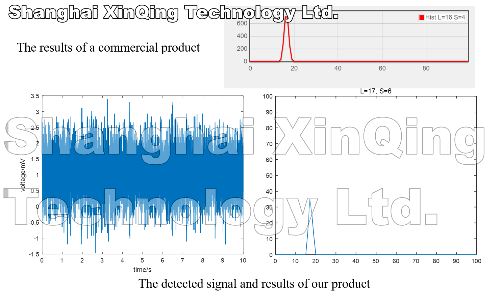
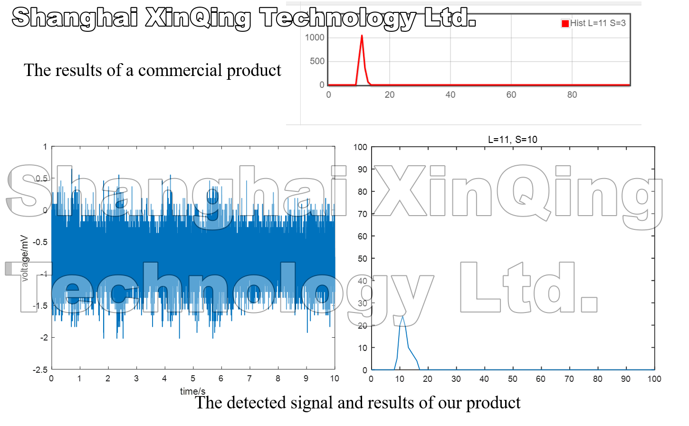

Shanghai Industrial μTechnology Research Institute (SITRI) 
======
Time: 2020.07~2023.08 
Role: trainee, MEMS engineer, product development manager 

The work during trainee
-----
* An ultrasonic range-finding system is designed based on AlN PMUTs, which can realize ultrasonic writing and gesture recognition. 
* The ultrasonic range-finding system based on AlN PMUTs is combined with the UR3 manipulator based on ROS to realize the human-robot interaction between humans and collaborative robots. The experimental results show that the built human-robot interaction system can realize gesture tracking and obstacle avoidance. 

The work during MEMS engineer
-----
* The design, simulation and measurement of piezoelectric MEMS devices, especially PMUT, microphone, accelerometer, hydrophone, SAW and etc. 
* The development of sensor based on piezoelectric MEMS devices, such as: 
1.Designed and developed a miniaturized transit-time ultrasonic flowmeter based on ScAlN PMUTs for small-diameter applications. 
2.Designed and developed a high-sensitivity bowel sound electronic monitor based on PMUTs. 
3.Designed and developed a high sensitivity AlN-based MEMS hydrophone for pipeline leak monitoring. 
4.Designed and developed an ultrasonic target detection system based on PMUTs. 
5.Designed and developed a high-sensitivity MEMS accelerometer using the Sc0.8Al0.2N-based four beam structure. 
6.Designed and developed an acoustic localization sensor based on MEMS microphone array for partial discharge. 

The work during product development manager
-----
* Participated the technical proposal for the first sensor product (a noise logger for pipe leak detection), and collaborated with engineers to complete this product. 
* Signal processing and analysis for the noise logger and hydrophone. 
* Built the leak detection and location algorithm for noise logger and hydrophone. Several algorithms have been development, which can be applied in the MCU of noise logger or the server of website. The effect of the leak detection algorithm applied in the MCU of noise logger is similar to the current mature products. And the algorithms applied in the server of website can provide more accurate water leakage analysis. 
* The analysis and writing of patent. 

  

    
     
   

        Fig1. The result comparison of a commercial product and our product on a leaked pipeline.
    

    
 

 

   

    
     
   

        Fig2. The result comparison of a commercial product and our product on a unleaked pipeline.
    

    
 

 

 